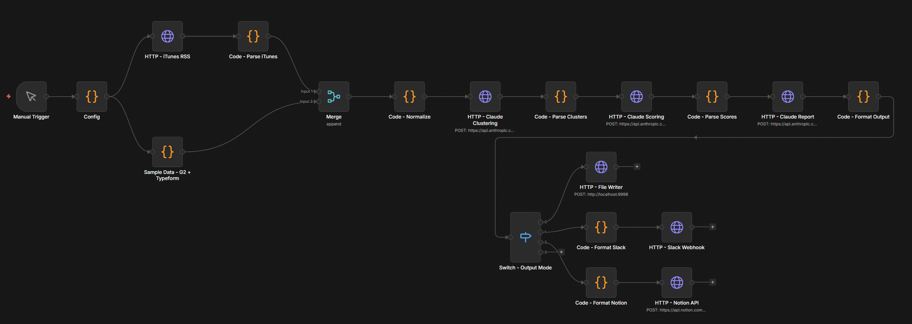

# Feature Request Intelligence Pipeline

> Turns scattered customer feedback from multiple sources into a scored, ranked backlog, automatically.

---

## The Problem

Customer feedback is scattered across App Store reviews, G2, Typeform, support tickets, and sales calls, each in a different format with different signal strengths. Synthesizing it into a prioritized backlog is manual, time-consuming, and still subjective: high-severity enterprise complaints get buried next to casual wishlist items, revenue signal is ignored, and effort is a gut call.

This pipeline automates that synthesis end-to-end.

---

## What It Does

Multi-source ingestion pipeline that normalizes customer feedback into a unified schema, uses Claude to perform thematic clustering, scores each cluster across four weighted dimensions, and emits a prioritized backlog report to Markdown, Slack, or Notion.

**Input sources:** App Store reviews (live via iTunes RSS), G2 reviews, Typeform responses, CSV upload

**Output:** A scored, ranked report with executive summary, theme-by-theme breakdown, representative quotes, and recommended next actions.

---

## Architecture



```
[Trigger: Manual or Weekly Cron]
        ↓
Parallel ingestion
  ├── iTunes RSS API   (live App Store reviews — no auth required)
  ├── G2 Reviews       (public RSS feed)
  ├── Typeform         (webhook or poll)
  └── CSV / Sheets     (upload or Google Sheets node)
        ↓
Merge + Normalize
(unified schema: text, source, date, rating per item)
        ↓
Claude — Thematic Clustering
(groups all feedback into named themes; assigns each item to a theme)
        ↓
Claude — Multi-Dimensional Scoring
(scores each theme: frequency · sentiment · revenue signal · effort)
        ↓
Sort by composite score
        ↓
Claude — Report Generation
(executive summary, ranked themes, representative quotes, recommendations)
        ↓
Switch: Output Mode (set in Config)
  ├── markdown  →  local file (via HTTP listener)
  ├── slack     →  Incoming Webhook with Block Kit formatting
  └── notion    →  Notion API page in target database
```

---

## Design Decisions

**Clustering over summarization.** Most feedback tools summarize: they tell you what people said. This pipeline clusters: it identifies which customers said the same thing in different ways and groups them together. Summarization flattens signal; clustering preserves it. Each cluster surfaces item count, source distribution, and verbatim feedback per item.

**RICE-adjacent scoring, not sentiment alone.** Sentiment tells you how people feel. It doesn't tell you what to build next. Each theme gets scored across four dimensions: frequency (how many items), sentiment (positive demand vs. frustration-driven churn risk), revenue signal (enterprise accounts, upgrade blockers, churned customers), and effort hint. The composite score produces a ranked list that maps directly to how a PM would actually prioritize, not just what's loudest.

**Chained prompts, not one big prompt.** The three Claude calls build on each other: clustering produces structured theme definitions, scoring operates on those definitions (not raw feedback), and the report generates from scored data. Each stage emits auditable output before the next prompt executes, making failures easy to isolate.

**Config node pattern.** All credentials and settings live in a single Code node at the start of the workflow. Every downstream node references `$node['Config'].json`. Changing the API key, output mode, or target app ID is a one-node operation: no hunting through 19 nodes to update a value.

---

## Sample Output

```
# Feature Request Intelligence Report
Generated: 2025-01-14 | Sources: 47 items across 4 sources

## Executive Summary
Customers are most frustrated by the lack of bulk export functionality,
with churn risk elevated among enterprise accounts. Mobile performance
issues represent a high-frequency complaint skewing heavily 1-star.
Collaboration features are requested with positive sentiment — users
want them rather than being blocked by their absence.

## Prioritized Themes

### 1. Bulk Export / Data Portability — Score: 91/100
- **Frequency:** 18 mentions across App Store, G2, and Typeform
- **Sentiment:** Strongly negative — described as a "dealbreaker" repeatedly
- **Revenue signal:** 4 enterprise accounts cited this in churned feedback
- **Effort hint:** API work + permissions model — medium complexity
- **Representative quotes:**
  > "We can't use this at scale without a way to export everything at once." — G2, 2 stars
  > "I've been waiting 2 years for bulk export. Moving to a competitor." — App Store, 1 star

### 2. Mobile Performance — Score: 78/100
- **Frequency:** 14 mentions (App Store-heavy)
- **Sentiment:** Negative — frustration, not feature requests
- **Revenue signal:** Low (consumer segment; no enterprise signals detected)
- **Effort hint:** Platform-level performance work — high complexity
- **Representative quotes:**
  > "Crashes every time I try to open a large file on iPhone." — App Store, 1 star

### 3. Real-Time Collaboration — Score: 61/100
- **Frequency:** 9 mentions across G2 and Typeform
- **Sentiment:** Positive — framed as excitement, not frustration
- **Revenue signal:** 2 mid-market accounts mentioned in expansion feedback
- **Effort hint:** Infrastructure-level change — high complexity

## Recommended Next Actions
1. Prioritize bulk export: high frequency, confirmed revenue signal, active churn risk
2. Investigate mobile crash reports before next App Store release cycle
3. Add collaboration to roadmap with a public timeline — positive sentiment makes it a win to announce
```

---

## The AI Pipeline

Three Claude calls, chained: each builds on structured output from the last.

| Step | Prompt | Input | Output |
|------|--------|-------|--------|
| 1 | `prompts/clustering-prompt.md` | Raw feedback array (text, source, date, rating) | Named theme clusters with item assignments |
| 2 | `prompts/scoring-prompt.md` | Theme clusters + constituent items | Each theme scored: frequency · sentiment · revenue signal · effort |
| 3 | `prompts/report-prompt.md` | Scored + sorted clusters | Full Markdown report with exec summary, ranked themes, quotes, recommendations |

Claude doesn't see raw feedback at the scoring stage: it works from the clustering output. This reduces noise and keeps scoring focused on theme-level signal rather than individual item variation.

---

## Integrations

| Source | Method | Auth |
|--------|--------|------|
| App Store reviews | iTunes RSS API | None |
| G2 reviews | HTTP Request (public RSS) | None |
| CSV / Google Sheets | Google Sheets node | OAuth |
| Typeform | Typeform trigger | API key |
| Claude | Anthropic API | API key |
| Slack (output) | Incoming Webhook | Webhook URL |
| Notion (output) | Notion API | Integration token |

---

## Build Phases

- [x] **Core Pipeline:** Sample data (22 rows, no external credentials) → Claude clustering + scoring + report → Markdown output
- [x] **Multi-Source Ingestion:** Live App Store RSS (iTunes API) + G2/Typeform sample → Merge node → same Claude pipeline
- [x] **Multi-Output Routing:** Switch node routes output to Markdown, Slack, or Notion based on `outputMode`

---

## Setup

### Prerequisites
- n8n running locally or on Cloud
- `file-writer.ps1` running on `localhost:9998` (Markdown output mode only; see [File writing workaround](#file-writing-workaround) below)

### Core Pipeline: Sample data, no external credentials needed

1. Import `workflows/phase-1-csv-to-report.json` into n8n
2. Open the **Config** node and set your Anthropic API key
3. Run `file-writer.ps1` (Markdown mode only)
4. Click **Execute Workflow**
5. Report appears in `outputs/YYYY-MM-DD-feature-request-report.md`

### Multi-Source Ingestion: Live App Store reviews + G2/Typeform

1. Import `workflows/phase-2-multi-source.json`
2. Open **Config** and set `apiKey` and `appId` to your target app
   - App ID is the number after `/id` in any App Store URL:
     ```
     https://apps.apple.com/us/app/notion/id1252015962
                                             ^^^^^^^^^^
     ```
   - Default app ID (Notion: 1252015962) runs without modification
3. Run `file-writer.ps1` and click **Execute Workflow**

### Multi-Output Routing: Markdown, Slack, or Notion

1. Import `workflows/phase-3-multi-output.json`
2. Open **Config** and set:
   - `outputMode`: `'markdown'` | `'slack'` | `'notion'`
   - `slackWebhookUrl`: Incoming Webhook URL (Slack mode)
   - `notionApiKey` + `notionDatabaseId` (Notion mode)

**Slack:** [api.slack.com/apps](https://api.slack.com/apps) → New App → Incoming Webhooks → Add to Workspace → copy URL

**Notion:** [notion.so/my-integrations](https://www.notion.so/my-integrations) → New Integration → copy token → share your database with the integration → copy database ID from its URL

### File writing workaround

n8n's Code node sandbox blocks `fs`. Markdown output works by POSTing to a local HTTP listener instead:

```powershell
powershell -ExecutionPolicy Bypass -File "path\to\file-writer.ps1"
```

`file-writer.ps1` is available in the [ContextRadar](../ContextRadar) project in this repository, or copy it into this directory.

---

## Files

```
workflows/     — n8n workflow JSON (one per phase; public files use REPLACE_WITH_... placeholders)
prompts/       — Claude prompt templates: clustering, scoring, report
samples/       — Sample input CSV + example output report
docs/          — Architecture notes and implementation decisions
```

